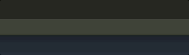

<p align="center">English / <a href="docs/README.ja.md">日本語</a></p>

# Overview

This is the development repository for the `StatusBarMessageQueue` class, designed for VSCode extension development. 

The repository also includes the `DynamicWait` class, which is a dependency of `StatusBarMessageQueue`.

---

# StatusBarMessageQueue Class

The `StatusBarMessageQueue` class provides a queuing mechanism for sequentially displaying messages using `vscode.window.setStatusBarMessage`.

By default, calling `setStatusBarMessage` overwrites any message previously displayed by another call to the same method. 

With the `StatusBarMessageQueue` class, messages intended for `setStatusBarMessage` are queued and displayed sequentially (or in order of priority, if specified). 

Additionally, the class includes a feature to compress the display duration of each message to ensure the total display time does not exceed the maximum allowed duration (default: 10 seconds).

Being a singleton, the shared queue can be accessed from anywhere in your project simply by importing the class.


## USAGE

```ts
const messageQueue = StatusBarMessageQueue.getInstance();

messageQueue.enqueue( "I'm watching you.",3000 );
messageQueue.enqueue( "I am a cat.",3000 );
messageQueue.enqueue( "Give me a snack.",3000 );
```




